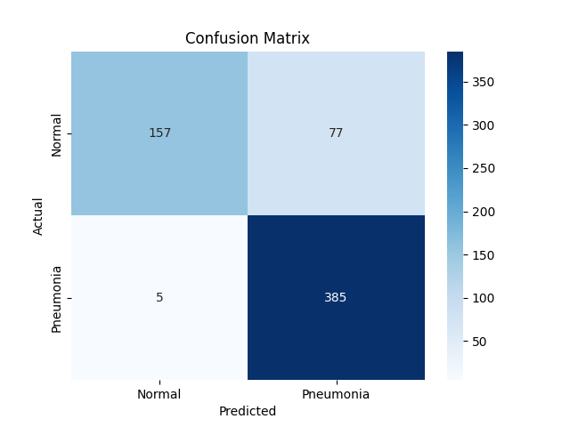
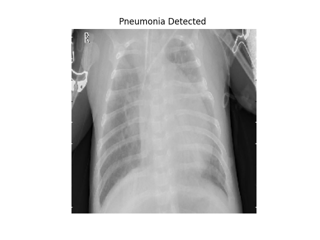

# Pneumonia Detection 🩺🧠

This project uses **MobileNetV2** with transfer learning to classify chest X-ray images as **Pneumonia** or **Normal**.

---

## 📂 Dataset

The dataset is divided into:
- `train/`
- `val/`
- `test/`

It contains X-ray images labeled as `NORMAL` or `PNEUMONIA`.

---

## ⚙️ Model

- Pretrained on ImageNet (`MobileNetV2`)
- Fine-tuned on the pneumonia dataset
- Final layer: Sigmoid activation (binary classification)
- Saved as: `mobilenet_pneumonia_model.h5`

[📥 Download model (.h5)]((https://drive.google.com/file/d/1Gt4pJ8N_5HjStZs9mVSXCfeG1TCl0clS/view?usp=drive_link)) 

---

## 🧪 Results

### 📊 Confusion Matrix


### 🩻 Sample Prediction


---

## 📈 Accuracy

Achieved **~96% accuracy** on the test dataset.

---

## 🚀 How to Run

```bash
pip install -r requirements.txt
python pneumonia_detection.py
